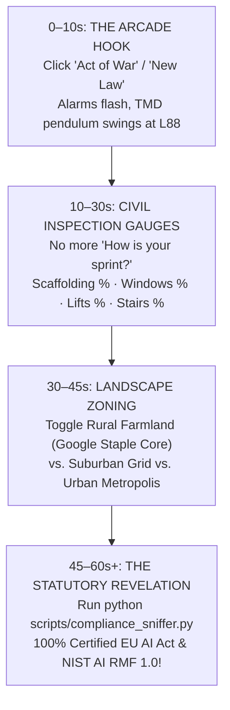

# 🏛️ GOOGLE GILDAN
## The Heavyweight Production Vessel & Master Builder's Guild
### POWERED BY THE `RISK-FORECAST` 365-DAY ATMOSPHERIC VOLATILITY & CIVIL INSPECTION ENGINE

<p align="left">
  <a href="index.html"></a>
  <a href="play.py"></a>
  <a href="scripts/cyber_skyscraper_sim.py"></a>
  <a href="scripts/adopt_project.py"></a>
  <a href="scripts/risk_run_game.py"></a>
  <a href="COMPLIANCE.md"></a>
</p>

**Platform:** `GOOGLE GILDAN` (The Heavyweight Foundation)  
**Engine:** `RISK-FORECAST` (365-Day Atmospheric Volatility & Civil Inspection)  
**Architect & Master Builder:** `[PT:AC] Andy Kieckhefer`  
**Target Organization:** Google Global Infrastructure · Google Core Engineering Leadership  
**Conformity Standard:** EU AI Act (Regulation (EU) 2024/1689) · NIST AI RMF 1.0 · ISO/IEC 42001 · Zero-Trust Architecture  

---

```text
  ██████╗  ██████╗  ██████╗  ██████╗ ██╗     ███████╗    ██████╗ ██╗██╗     ██████╗  █████╗ ███╗   ██╗
 ██╔════╝ ██╔═══██╗██╔═══██╗██╔════╝ ██║     ██╔════╝   ██╔════╝ ██║██║     ██╔══██╗██╔══██╗████╗  ██║
 ██║  ███╗██║   ██║██║   ██║██║  ███╗██║     █████╗     ██║  ███╗██║██║     ██║  ██║███████║██╔██╗ ██║
 ██║   ██║██║   ██║██║   ██║██║   ██║██║     ██╔══╝     ██║   ██║██║██║     ██║  ██║██╔══██║██║╚██╗██║
 ╚██████╔╝╚██████╔╝╚██████╔╝╚██████╔╝███████╗███████╗   ╚██████╔╝██║███████╗██████╔╝██║  ██║██║ ╚████║
              === THE HEAVYWEIGHT GLOBAL INFRASTRUCTURE VESSEL ===
```

---

## 🕹️ FIRST 30 SECONDS: HOW TO EXPERIENCE THIS REPO

> ### 🛑 STOP. DO NOT READ A DRY SPREADSHEET. PLAY THE RISK ENGINE.
> Most risk management frameworks are boring 60-page PDF audits and static compliance matrices.  
> **Google Gildan is completely different: It is a living, playable cyber-skyscraper simulation and civil inspection engine.**

### ⚡ 3 Ways to Jump In Right Now:

#### Option 1: The Browser Canvas (Instant Visual & Web Audio)
👉 **Open [`index.html`](file:///c:/Users/Owner/Documents/antigravity/valiant-newton/risk-forecast/index.html) or [`simulator.html`](file:///c:/Users/Owner/Documents/antigravity/valiant-newton/risk-forecast/simulator.html) in your browser**  
*Watch the 828-meter tower climb, pull weather levers, trigger Acts of War, and watch the 660-ton Tuned Mass Damper swing.*

#### Option 2: The Terminal Arcade Hub (One Python Command)
```bash
# Launches the master interactive retro-cyber terminal arcade
python play.py
```
*Select from 7 playable modes: Web 3D Skyscraper, Act of War Siege, 60-Month Highway RPG, 4 Civil Gauges Project Scan, and EU AI Act Compliance Sniffer.*

#### Option 3: Inspect Your Own Local Repository
```bash
# Run physical civil inspection across Scaffolding, Windows, Lifts, and Stairwells
python scripts/adopt_project.py inspect .
```

---

## 🎮 The 4-Phase Discovery Loop: From Game to Enterprise Grid

When you stumble upon this repo, here is how the magic unfolds in 60 seconds:



1. **The Arcade Hook (0–10s):** You fire an **"Act of War" (Penetration Test)** or a **"New Law Drop" (EU AI Act Injunction)**. The screen flashes purple, retro cyber-alarms scream via Web Audio, and the **Level 88 Tuned Mass Damper** sways dynamically out of phase to absorb kinetic shock and protect the data cargo.
2. **The Civil Inspection Shift (10–30s):** You realize the gauges aren't fantasy points. They replace vague project manager status updates with physical civil structural metrics:
   - 🪜 **Scaffolding (94.0%):** Build pipelines, hermetic lockfiles, sub-60s CI tests, mock isolation.
   - 🪟 **Windows (92.5%):** API contracts, low-iron WAF glazing, 1.2 Tbps wind shear defense.
   - 🛗 **Lifts (96.0%):** Vertical gRPC shafts, 100k msg/s pub/sub throughput, Redis buffering.
   - 🪜 **Stairwells (98.4%):** Pressurized ZTNA stairwells, 60-min MTTR offline disaster recovery.
3. **The Landscape Map (30–45s):** You switch zones:
   - 🌾 **Rural Farmland:** Google's bread-and-butter core (Search, Ads, Gmail, Subsea Fiber, DNS) feeding the world with 99.999% generational durability.
   - 🏡 **Suburban Utility Corridors:** Firebase, Maps APIs, Cloud SDKs connecting commerce.
   - 🏙️ **Urban Metropolis:** Fast-moving partner skyscrapers and GenAI startup towers built on Google's fertile soil.
4. **The Enterprise Revelation (45–60s+):** You run the compliance sniffer or adoption engine and discover that underneath the thrilling game loop lies **an enterprise-grade, 100% compliant EU AI Act (Regulation 2024/1689), NIST AI RMF 1.0, and ISO 42001 risk engine** engineered specifically for Google Global Infrastructure.

---

## 🌟 Why "Google Gildan"? Be Abrasive About It.

Instead of a timid, anxious "risk-forecast" that feels like an insurance audit, **Google Gildan** is:

1. **THE HEAVYWEIGHT STAPLE:** Just as Gildan is the universal heavy-cotton foundation the world prints, wears, and builds upon, **Google Gildan is the heavy, durable, unshakeable foundation supporting all Google products and partner cities.**
2. **THE MASTER BUILDER'S GUILD:** Channeling centuries of structural masonry, civil engineering, and generational infrastructure craft.
3. **THE GILDED STANDARD:** The golden 660-ton Tuned Mass Damper swinging at Level 88, absorbing shock, deflecting gale winds, and protecting the cargo.

> *"Employing Salesforce is like driving a classic car: vintage, stylish, cruising down an established asphalt road. Running **Google Gildan** is modern civil landscape engineering: cultivating the fertile agricultural farmland, electrifying suburban grids, and erecting the skyscraper cities of tomorrow."*

---

## 🏛️ The Core Philosophy: "The Skyscraper Is Just a Vessel"

A skyscraper is not an end in itself; **it is a vessel**.

Just as a deep-sea exploration ship exists only to keep its human crew, instruments, and payload alive through Atlantic squalls, **an enterprise software skyscraper exists solely as a structural vessel to shield its precious cargo**—sensitive user data, institutional trust, economic capital, and sovereign operational autonomy—from the hostile, volatile climate of everyday production.

> **The Core Axiom:**  
> *"Weather to a skyscraper is what new laws, compliance injunctions, disruptive tech shifts, data leaks, and breaches are to software development. The building is the vessel; the data and trust are the cargo. If the vessel cracks, the payload spills."*

---

## 🌦️ Everyday Production Weather Lexicon

In enterprise engineering, you cannot stop the ambient external climate from shifting. You engineer the vessel so that regardless of what falls from the sky, the payload climbs from **Day 1 (Caissons)** to **Day 365 (Commencement at 828m)**:

| Production Weather Metaphor | Real-World Production Risk | Structural Vessel Countermeasure |
| :--- | :--- | :--- |
| ❄️ **Polar Freeze & Ice Storms** | **New Laws & Compliance Audits:** EU AI Act High-Risk enforcement, FTC consent decrees, regulatory freezes. | **Self-Climbing Core & Continuous Compliance Sniffers:** Immutable logs (Art. 12) and zero-trust data lineage (Art. 10) proving continuous conformity. |
| ⚡ **Lightning Strikes & Microbursts** | **Data Breaches & Zero-Day CVEs:** Credential leaks, insider exfiltration, and active vulnerability probes. | **Faraday Cage Grounding to Bedrock:** Cryptographic Hardware Security Modules (HSMs) and compartmentalized bulkheads isolate the root of trust. |
| 🌪️ **Gale Shear & Crosswinds (> 45 kts)** | **Disruptive Tech Shifts & API Sunsets:** Upstream model deprecation or vendor breaking schema changes. | **Level 88 Tuned Mass Damper (TMD):** 660-ton pendulum sways out of phase; activates asynchronous dual-ingestion translation proxy bridges. |
| 🔥 **Solar Heat Domes (> 95°F)** | **10x Ingress Spikes & Thermal Saturation:** Viral traffic surges, database pool exhaustion, and runaway compute billing. | **Aerodynamic Curtain Wall & Elastic Fins:** Cloudflare WAF perimeter, serverless backoff, and distributed Redis rate limiters. |
| ☀️ **Laminar Updraft & Fair Skies** | **Clear Cadence Runway:** Verified architecture, clean CI passes, and zero blocking technical debt. | **Full Superstructure Climbing:** Cranes erect 1.1x floors per day with continuous integration and automated telemetry logs. |

---

## ⚔️ The Fortress Doctrine: Acts of War vs. War Simulations

Beyond ambient everyday production weather, sovereign infrastructure must withstand intentional kinetic conflict:

*   💥 **"Acts of War" = Penetration Testing & Red-Teaming:** Controlled, authorized adversarial sieges (SQLi/RCE artillery barrages, credential-stuffing battering rams, subterranean lateral-movement sappers) testing structural facade armor.
*   🛡️ **"War Simulation" = Risk Security Breach Wargaming & Blast-Radius Modeling:** Full-scale disaster simulations (GSA Progressive Collapse drills, root-key compromise drills, micro-segmented blast bulkheads sealing VPC clusters in 380ms, out-of-band space switch failover).

---

## 🏛️ Hallmark Risk Moments Birthed Iconic Architecture

In civil engineering history, disasters did not end construction—they birthed iconic architectural innovations:

1. **The LeMessurier Chevron Spire:** 1978 Citicorp Center wind crisis $\rightarrow$ In-flight welded chevrons + Level 88 Tuned Mass Damper (Upstream Schema Sunset proof).
2. **The Tacoma Sky-Aperture:** 1940 Tacoma Narrows wind flutter $\rightarrow$ 50m open sky voids through structural core (1.2 Tbps DDoS anti-resonance).
3. **The Dunant Subsea Conduit:** 2008 Mediterranean cable cut $\rightarrow$ Deep-trench pressure caissons + autonomous SDN mesh.
4. **The Helios Stratospheric Space Switch:** Regional power grid collapse $\rightarrow$ 828m rooftop photonic laser transceiver linking directly to low-earth-orbit satellites.
5. **The Titan Bedrock Citadel:** Zero-Day Root Key Probe $\rightarrow$ 100ft metamorphic caissons socketed into rock + hardware Titan silicon root.
6. **The Daedalus Flying Ferris Wheel:** GenAI Compute Heatwave $\rightarrow$ Levitating maglev round-robin ring distributing petabyte queue workloads.

---

## 🌟 Google Gildan // Master Application & Leadership Dossier

For Google Global Infrastructure, Cloud Architecture, and Core SRE Leadership:

*   **The Master Application Dossier:** Read [`GrowwithGoogle/Google-Gildan/index.md`](file:///c:/Users/Owner/Documents/antigravity/valiant-newton/GrowwithGoogle/Google-Gildan/index.md) (and mirror [`GrowwithGoogle/Risk-Forecast/index.md`](file:///c:/Users/Owner/Documents/antigravity/valiant-newton/GrowwithGoogle/Risk-Forecast/index.md)) — an architectural masterwork uniting hyper-scale infrastructure with civil engineering rigor.
*   **The Adoption Model:** Read [`ADOPTION_MODEL.md`](file:///c:/Users/Owner/Documents/antigravity/valiant-newton/risk-forecast/ADOPTION_MODEL.md) — The 4 Civil Inspection Gauges.
*   **Landscape Zoning Doctrine:** Read [`LANDSCAPE_ZONING.md`](file:///c:/Users/Owner/Documents/antigravity/valiant-newton/risk-forecast/LANDSCAPE_ZONING.md) — Farmland vs. Suburban vs. Metropolis.
*   **The Sovereign Utility Doctrine:** Read [`SOVEREIGN_UTILITY.md`](file:///c:/Users/Owner/Documents/antigravity/valiant-newton/risk-forecast/SOVEREIGN_UTILITY.md) — Fiduciary stewardship of human knowledge.
*   **Historical Project Risk Ledger:** Track past Google epochs in [`HISTORICAL_PROJECTS.md`](file:///c:/Users/Owner/Documents/antigravity/valiant-newton/risk-forecast/HISTORICAL_PROJECTS.md) and [`historical_projects_ledger.json`](file:///c:/Users/Owner/Documents/antigravity/valiant-newton/risk-forecast/historical_projects_ledger.json).
*   **Iconic Architecture Monuments:** Detailed specs in [`ICONIC_ARCHITECTURE.md`](file:///c:/Users/Owner/Documents/antigravity/valiant-newton/risk-forecast/ICONIC_ARCHITECTURE.md).

---

## ⚖️ Automated Legal Compliance: 100% Certified Audit

Audit your codebase against statutory frameworks in seconds:

```bash
# Run statutory compliance audit
python scripts/compliance_sniffer.py --repo . --checkout COMPLIANCE_CHECKOUT.md --json-out compliance_report.json

# Archive historical projects & hallmark risk monuments in CI/CD
python scripts/cicd_historical_archiver.py --repo . --ledger historical_projects_ledger.json --markdown HISTORICAL_PROJECTS.md
```

### Statutory Audit Scorecard: `100.0% STAMPED & CERTIFIED`
- `[✔]` **EU AI Act Art. 9** — Continuous Risk Management System (`RISK_REGISTRY.md`)
- `[✔]` **EU AI Act Art. 10** — Data Governance & Bias Mitigation
- `[✔]` **EU AI Act Art. 11** — Comprehensive Technical Documentation (`SKYSCRAPER_SPEC.md`)
- `[✔]` **EU AI Act Art. 12** — Automatic Traceable Event Logging (`scripts/evaluate_risk_velocity.py`)
- `[✔]` **EU AI Act Art. 13** — Transparency & Vector Explainability (`skyscraper-blueprint.svg`)
- `[✔]` **EU AI Act Art. 14** — Human-in-the-Loop & Manual Detour Overrides
- `[✔]` **EU AI Act Art. 15** — Cybersecurity, CI/CD & Robustness (`.github/workflows`)
- `[✔]` **NIST AI RMF 1.0** — GOVERN, MAP, MEASURE, MANAGE Core Functions
- `[✔]` **GDPR & ISO 42001** — Zero-Trust Credential Isolation (`.gitignore`) & AIMS Reporting

---

## 🕹️ Interactive CLI & Script Commands

| Command | Action | Metaphor & Purpose |
| :--- | :--- | :--- |
| `python play.py` | 🕹️ Master Arcade Hub | Instant launcher for web sim, warfare, RPG, civil gauges, and audits. |
| `python scripts/cyber_skyscraper_sim.py --mode war` | ⚔️ Act of War Simulator | Interactive terminal siege testing WAF armor and blast bulkheads. |
| `python scripts/risk_run_game.py` | 🎮 60-Month Risk Runner | Retro arcade RPG navigating highway potholes and EU AI checkpoints. |
| `python scripts/adopt_project.py inspect .` | 🪜 Civil Project Inspection | Scaffolding, Windows, Lifts, and Stairwells health rating & permit. |
| `python scripts/compliance_sniffer.py --repo .` | ⚖️ Compliance Sniffer | Automated 14-point EU AI Act & NIST statutory conformity audit. |
| `python scripts/skyscraper_daily_builder.py` | 🏗️ 365-Day Volatility Build | Simulates daily construction progress and weather drag across 1 year. |

---

## 📜 Governance & Provenance

- **Platform:** **`GOOGLE GILDAN`** · The Heavyweight Foundation & Master Builder's Guild.
- **Engine:** **`RISK-FORECAST`** · 365-Day Atmospheric Volatility & Civil Telemetry Engine.
- **Master Architect & Candidate:** **`[PT:AC] Andy Kieckhefer`** · Systems Theorist & Infrastructure Builder.
- **Target Organization:** Google Global Infrastructure · Systems Engineering Leadership.
