# 🏙️ THE SYNOPTIC SPIRE // APEX TOWER

### 365-Day Volatility Anticipation & High-Rise Legal Resilience Engine
**Architect & Master Builder:** `[PT:AC] Andy Kieckhefer`  
**Conformity:** EU AI Act (Regulation (EU) 2024/1689) · NIST AI RMF 1.0 · ISO/IEC 42001 · Zero-Trust Architecture

---

<p align="center">
  
</p>

---

## 🏛️ Executive Concept: "The Skyscraper Is Just a Vessel"

A skyscraper is not an end in itself; **it is a vessel**. 

Just as a deep-sea exploration ship exists only to keep its human crew, instruments, and mission alive through crushing oceanic squalls, **an enterprise software skyscraper exists solely as a structural vessel to shield its precious cargo**—user data, institutional trust, economic capital, and operational autonomy—from the hostile, volatile climate of everyday production.

> **The Core Axiom:**
> *"Weather to a skyscraper is what new laws, compliance injunctions, disruptive tech shifts, data leaks, and breaches are to software development. The building is the vessel; the data and trust are the cargo. If the vessel cracks, the payload spills."*

**The Synoptic Spire achieves generational resilience through three vessel doctrines:**
1. **The Aerodynamic Hull (WAF & Facade):** Curved, spiraling setbacks that deflect external bot traffic, DDoS gales, and vortex shedding before kinetic resonance builds.
2. **The Tuned Mass Damper (Circuit Breaker & Fallback):** A golden 660-ton pendulum suspended at Level 88 that sways counter to sudden regulatory shifts, upstream vendor deprecations, and market volatility, damping shock by over 42%.
3. **Bedrock Cryptographic Caissons (Zero-Trust Root):** Driven 100 feet into Manhattan schist bedrock, certified under the **EU AI Act**, **NIST AI RMF 1.0**, and **ISO 42001** before steel is hoisted, ensuring no data breach can topple the core root of trust.

---

## ⚡ The 365-Day Atmospheric Volatility Mapping

Just as civil engineers study 100-year wind tunnel data, `Risk-Forecast` anticipates daily atmospheric conditions across all 365 days of the calendar year to keep continuously iterating the build without structural failure:

| Atmospheric Phenomenon | Meteorological Evidence | Enterprise Engineering Analog | Built-In Volatility Countermeasure |
| :--- | :--- | :--- | :--- |
| 🌪️ **Gale Crosswinds (> 45 kts)** | Sharp barometric pressure drops, high-altitude jetstream shear. | **Upstream API Turbulence:** External vendor sunsets schema or changes authentication tokens without notice. | **Aerodynamic Detour Damper:** Ingress auto-reroutes through asynchronous dual-ingestion proxy bridges. |
| ❄️ **Polar Vortex & Freezing Rain** | Sub-zero temperatures, surface ice loading, frozen machinery. | **Governance & Capital Freezes:** Budget review freezes, corporate re-orgs, procurement review stalls. | **Subterranean Core Focus:** Build shifts to internal core scaffolding, lockfile freezes, and deterministic Nix/Docker builds. |
| ⚡ **Severe Lightning & Microbursts** | Rapid convective updrafts, cloud-to-ground electrical discharge. | **Zero-Day Vulnerability / DDoS:** High-concurrency malicious traffic or security vulnerability discovered. | **Faraday Cage / Zero-Trust Grid:** Automated mTLS isolation, rate-limiting tokens, and instant cryptographic key rotation. |
| ☀️ **Solar Heat Dome (> 95°F)** | High-pressure thermal stagnation, thermal metal expansion. | **Compute Saturation & Cloud Spikes:** Runaway cloud billing, memory leaks, high database connection pool strain. | **Elastic Thermal Throttling:** Auto-scaling serverless backoff and distributed Redis caching queues. |
| 🌤️ **Fair Skies & Laminar Updraft** | 1013.25 hPa stable high, calm surface breezes (8 kts). | **Optimal Cadence Runway:** High engineering velocity, zero regulatory blocking gates. | **Full Superstructure Climbing:** Cranes erect 1.1x floors per day with continuous CI/CD integration. |

---

## ⚖️ Full Legal Compliance Dossier (Stamped & Certified)

The building's blueprints are stamped by international regulatory bodies, converting bureaucratic red-tape into structural load-bearing armor:

```text
+---------------------------------------------------------------------------------------+
| OFFICIAL REGULATORY INSPECTION & PERMIT DOSSIER                                       |
+---------------------------------------------------------------------------------------+
| [✔] EU AI ACT ART. 9 (Risk Management)   : Bedrock Hazard Registry Verified & Living  |
| [✔] EU AI ACT ART. 10 (Data Governance)  : Zero-Trust Data Lineage & Bias Isolation   |
| [✔] EU AI ACT ART. 11 (Technical Docs)   : Full Blueprint Dossier & Architecture Map  |
| [✔] EU AI ACT ART. 12 (Event Logging)    : Immutable 365-Day Daily Telemetry Logs     |
| [✔] EU AI ACT ART. 13 (Transparency)     : Real-Time Vector Roadmap & Visible HUD     |
| [✔] EU AI ACT ART. 14 (Human Oversight)  : Manual Detour Levers & Crane Lockouts      |
| [✔] EU AI ACT ART. 15 (Cyber Resilience) : Multi-Tier Faraday Exoskeleton / CI/CD     |
| [✔] NIST AI RMF GOVERN 1.1               : Municipal & Statutory Mapping In Effect    |
| [✔] NIST AI RMF MAP 1.1                  : 365-Day Wind Tunnel Volatility Mapped      |
| [✔] NIST AI RMF MEASURE 1.1              : Strain Gauges & Friction Telemetry Active  |
| [✔] NIST AI RMF MANAGE 1.1               : Tuned Mass Damper Mitigation Engaged       |
| [✔] FINAL CERTIFICATE OF OCCUPANCY       : ISSUED FOR GENERATIONAL DURABILITY         |
+---------------------------------------------------------------------------------------+
```

---

## 🏗️ 365-Day Iterative Construction Cadence

The skyscraper is erected through four distinct architectural seasons:

```text
[ DAYS 1–60 ]              [ DAYS 61–150 ]            [ DAYS 151–250 ]           [ DAYS 251–365 ]
BEDROCK CAISSONS       →   CONCRETE/STEEL CORE    →   AERODYNAMIC CURTAIN    →   TUNED MASS DAMPER & SPIRE
• 100ft Piles into Rock    • Subterranean Vaults      • Low-Iron Glazing         • 660-Ton Golden Pendulum
• EU AI Art. 9/10          • NIST GOVERN / MAP        • Diagrid Cross-Bracing    • Final Occupancy Permit
• Deep Threat Modeling     • Continuous CI Pipelines  • Vortex Shedding Scupt    • 828m Apex Spire Needle
```

### 1. Days 1–60: Deep Bedrock Excavation (Foundation)
- Deep slurry walls and reinforced caissons socketed directly into metamorphic bedrock.
- Establishes zero-trust boundary, private key vaults, and baseline regulatory mappings.

### 2. Days 61–150: The High-Strength Concrete Core
- The vertical spine of the building, housing elevator banks, emergency stairs, and continuous data conduits.
- Built using self-climbing formwork that can withstand winter polar vortex freezes.

### 3. Days 151–250: Superstructure & Aerodynamic Curtain Wall
- Double-glazed low-emissivity glass curtain wall with integrated solar shading fins.
- Each floor plate rotates 1.5 degrees as the tower rises, breaking wind vortices into harmless micro-eddies.

### 4. Days 251–365: Tuned Mass Damper & Apex Spire
- Suspension of the 660-ton golden sphere on hydraulic shock absorbers between Floors 87 and 91.
- Erection of the steel needle spire piercing 828 meters into the stratosphere.
- Stamping of the final **Certificate of Occupancy** for enterprise commencement.

---

## ⚔️ Acts of War vs. War Simulation: The Fortress Doctrine

While everyday production weather (wind, rain, solar heat) represents continuous environmental friction, **a sovereign vessel must also survive intentional, kinetic conflict**:

```text
+-----------------------------------------------------------------------------------------+
|                  THE FORTRESS DOCTRINE: WARFARE & RESILIENCE MATRIX                     |
+-----------------------------------------------------------------------------------------+
| DOCTRINE                | CIVIL / MILITARY ANALOG       | ENTERPRISE CYBER EQUIVALENT   |
+-------------------------+-------------------------------+-------------------------------+
| 💥 ACTS OF WAR          | Intentional hostile siege,    | PENETRATION TESTING &         |
|                         | artillery bombardment, and    | RED-TEAM ADVERSARY EMULATION: |
|                         | bunker-busting bunker shells. | Continuous offensive assaults |
|                         |                               | testing exterior hull armor.  |
+-------------------------+-------------------------------+-------------------------------+
| 🛡️ WAR SIMULATION       | Full-scale disaster wargame:  | RISK SECURITY BREACH WARGAME: |
|                         | Column destruction, power cut,| Blast-radius modeling, root-key|
|                         | and catastrophic containment. | compromise drill, and bulkhead|
|                         |                               | isolation rehearsals (BAS).   |
+-----------------------------------------------------------------------------------------+
```

### 1. "Acts of War" = Penetration Testing & Red-Teaming
*   **The Metaphor:** In civil defense, an *Act of War* is not random rain. It is a calculated, deliberate kinetic siege by an intelligent adversary attempting to breach the perimeter, shatter structural columns, and loot the interior vaults.
*   **The Cyber Reality:** **Penetration Testing (Ethical Hacking / Red Teaming)** is an authorized, intentional Act of War against your own vessel. 
*   **Vessel Countermeasures:**
    *   **Blast-Resistant Curtain Wall:** Multi-layered laminated glass designed per DoD UFC 4-010-01 to absorb shockwaves without sending lethal shrapnel into interior trading floors. (In cyber: Cloudflare WAF, ModSecurity, and automated rate-limiting shields deflecting SQLi/RCE payloads).
    *   **Airlock & Man-Trap Entrances:** Physical biometric multi-factor authentication checkpoints preventing unauthorized foot ingress. (In cyber: FIDO2 WebAuthn hardware keys and Zero-Trust Network Access / ZTNA).

### 2. "War Simulation" = Risk Security Breach Wargaming & Blast-Radius Modeling
*   **The Metaphor:** A *War Simulation* does not just test the front door. It assumes the front door has already been vaporized by a cruise missile, and asks: *Does the entire skyscraper collapse, or do the compartmentalized blast bulkheads prevent progressive failure?*
*   **The Cyber Reality:** **Breach and Attack Simulation (BAS) & Incident Tabletop Exercises.** We simulate an active, catastrophic security breach:
    *   *Scenario A (Subterranean Infiltration):* A compromised third-party vendor token breaches the database.
    *   *Scenario B (Spire Decapitation):* DDoS attack severs the primary DNS/telemetry uplinks.
    *   *Scenario C (Root Compromise):* Cryptographic master signing key dumped on pastebins.
*   **Structural Progressive Collapse Prevention:**
    *   Engineered per **GSA Progressive Collapse Guidelines**: Even if two adjacent load-bearing columns on Floor 40 are severed, the structural steel transfer truss redistributes the load to neighboring caissons without catastrophic cascading failure.
    *   In cyber: Micro-segmented VPCs, ephemeral token revocations, and automated out-of-band kill-switches isolate compromised pods within 450 milliseconds, preserving 100% of non-compromised cargo.

---

## 💻 Running the Daily Volatility & War Simulation Engine

Execute the 365-day atmospheric builder and cyber-warfare simulator:

```bash
# Run 365-day weather volatility forecast & iterative construction
python scripts/skyscraper_daily_builder.py --out daily_weather_forecast_365.json

# Run interactive cyber skyscraper simulator with Pen-Test & Breach modes
python scripts/cyber_skyscraper_sim.py --mode war
```
